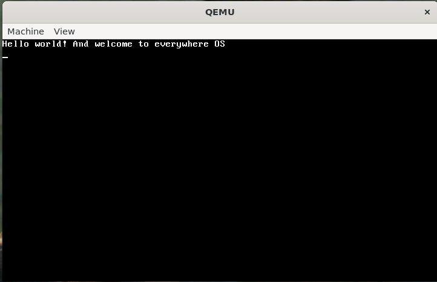

# 🌐 Everywhere OS

Modern [operating systems](https://en.wikipedia.org/wiki/Operating_system) face a fundamental problem; companies continually release updates to patch issues, fully aware that their systems fall short. Yet they rarely take the step of rethinking their platforms from the ground up. They avoid confronting the truth.

Everywhere OS is built to change that. It is an [operating system](https://en.wikipedia.org/wiki/Operating_system) designed to address long‑standing issues directly rather than covering them with temporary fixes.

**Why go anywhere when you're already everywhere?** - Clay Sanders, 2026

Everywhere OS was founded by **Clay Sanders** with a mission to create a system that truly works for everyone.

If you want to download our latest release, or just learn more, check out our homepage: Learn more: https://sites.google.com/view/everywhereos/home

# Building
Build using:

> Use this **only** if you have build files (*.o) in your root directory.
```bash
make clean
```

Build the OS:
```
make
```

Before running the OS, make sure you have [QEMU](https://www.qemu.org/download/)

> "sudo apt update" is optional
Ubuntu // Debian // Mint:
```bash
sudo apt update
sudo apt install qemu-system-i386
```

Fedora:
```bash
sudo dnf install qemu-system-i386
```

Arch Linux // Manjaro:
```bash
sudo pacman -S qemu-full
```

Alpine:
```bash
sudo apk add qemu-system-i386
```

Finally, to run the OS, do:
```bash
qemu-system-i386 -kernel kernel
```

